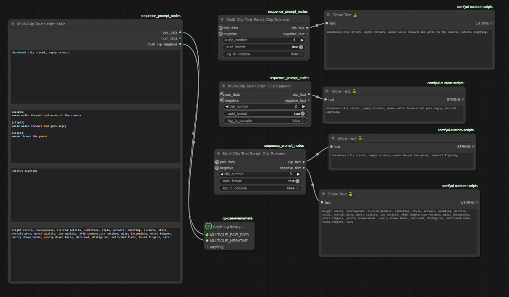
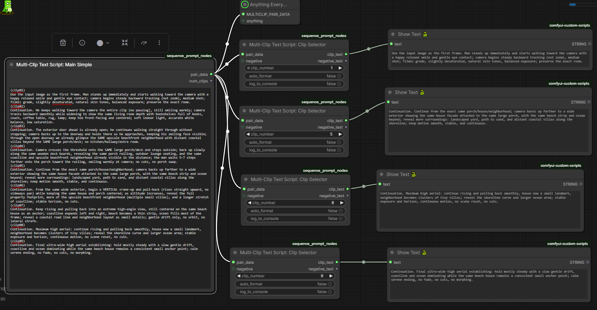
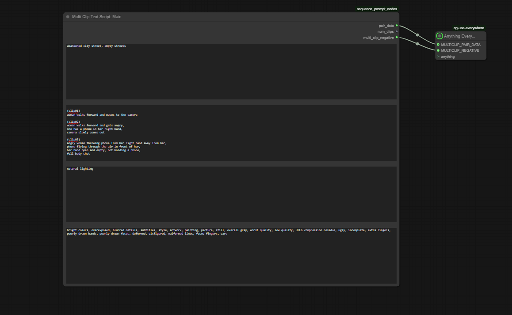
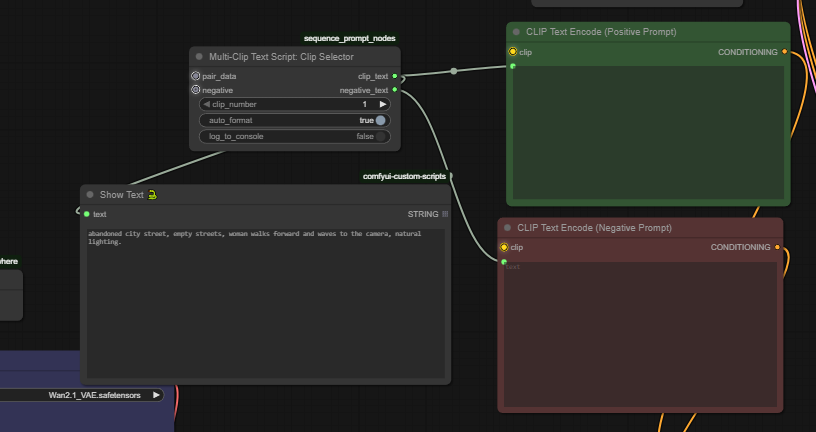
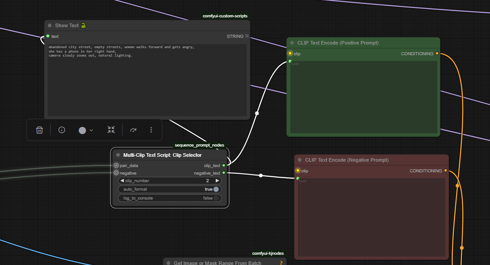
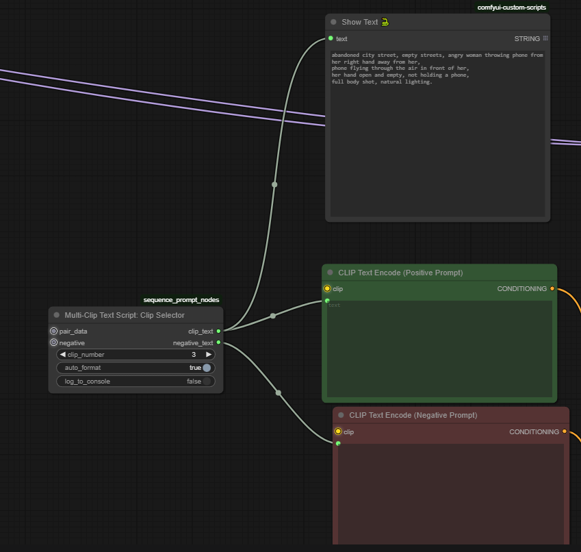

# ComfyUI Multi-Clip Text Script Nodes

**Version:** 1.1.1

<!-- Added a full-width overview image at the very top -->





## How to use it (visual)

<table>
  <tr>
    <td></td>
    <td></td>
  </tr>
  <tr>
    <td></td>
    <td></td>
  </tr>
</table>

This ComfyUI node was created while I was making Wan 2.2 videos with 81 frames and crossfading them together. I found myself dragging and clicking through different parts of the workflow to change clip text prompts, so I wanted a faster, centralized place to edit all prompts.

I added a simple version of the main node becase i did not really use the other stuff. I just copy the everything inside the "main simple" and paste it to chatgpt and tell chatgpt where it is failing...and it changes it. the prompt i have in the picture is not perfect prompt because when the camera is outside it shows a bit of a porch then it snaps to another porch more nicer, sometimes the prompt i get from chatgpt works sometimes not, i am using wan 2.2 svi v2.0 pro.

I added main simple in a local copy for testing and it worked, but then i uploaded an old __init__.py to github so the simple did not work from github. Main simple should work now.

This node was generated with ChatGPT 5.1, and this README was also written by ChatGPT.

Three simple nodes that help you author sequence-friendly prompts from a single script that contains multiple clips. You write one text block with (clip01), (clip02), … sections, then select one clip at a time to produce a clean prompt.

Nodes
- Multi-Clip Text Script: Main (with prefix/suffix/negative)
- Multi-Clip Text Script: Main Simple (simple version, no prefix/suffix/negative)
- Multi-Clip Text Script: Clip Selector

Category
- Text / Multi-Clip

File
- sequence_prompt_nodes.py


## Why this exists

- Keep consistent prompt parts across many shots (prefix/suffix/negative) while varying per-clip action text.
- Author all clips once, then iterate and render per-clip without copy/paste.
- Optional auto formatting to output a classic “prefix, clip, suffix.” prompt line.


## Installation
- Go to your ComfyUI/custom_nodes folder.

Clona the repo (exempel):

cd ComfyUI/custom_nodes
git clone https://github.com/TuonoMindCode/ComfyUI-MultiClip-Text-Script.git

or

Copy sequence_prompt_nodes.py and __init__.py into your ComfyUI/custom_nodes/ComfyUI-MultiClip-Text-Script.
Restart ComfyUI.
Search for:
  - "Multi-Clip Text Script: Main"
  - "Multi-Clip Text Script: Main Simple"
  - "Multi-Clip Text Script: Clip Selector"


## Script format

The Main node parses a single multiline script using labeled sections:

- Label each section with (clipXX) where XX is a number (1-based).
- Case-insensitive. Any number of digits is supported.
- Text for a clip runs until the next (clipYY) or the end of the script.

Example script

(clip01) woman walks forward and waves to the camera

(clip02) woman walks forward and gets angry

(clip03) woman throws the phone


Clips are sorted numerically by their label: (clip1), (clip02), (clip10) → 1, 2, 10.


## Node: Multi-Clip Text Script: Main

Purpose
- Parse the multi-clip script, store prefix/suffix and per-clip texts in an internal string (MULTICLIP_PAIR_DATA).
- Provide total clip count and a shared negative prompt for downstream nodes.

Inputs (required)
- prefix_text (STRING, multiline): Common description always included (subject, style, tempo, etc.).
- multi_clip_script (STRING, multiline): Your script with (clipXX) sections.
- suffix_text (STRING, multiline): Appended after every clip (camera style, quality, etc.).

Inputs (optional)
- negative_text (STRING, multiline): One negative prompt used for every clip.

Outputs
- pair_data (MULTICLIP_PAIR_DATA): Internal encoded data with prefix, suffix, and all clips.
- num_clips (INT): Number of parsed clips.
- multi_clip_negative (MULTICLIP_NEGATIVE): The shared negative prompt.

Details
- If no clips are found, pair_data still contains prefix and suffix. num_clips is 0.
- Leading/trailing whitespace is trimmed from all pieces.


## Node: Multi-Clip Text Script: Main Simple

Purpose
- Simplified version of Main without prefix/suffix options. Parse the multi-clip script and store per-clip texts in pair_data.
- Ideal when you only need the clip content without additional prefix/suffix/negative modifiers.

Inputs (required)
- multi_clip_script (STRING, multiline): Your script with (clipXX) sections.

Outputs
- pair_data (MULTICLIP_PAIR_DATA): Internal encoded data with all clips (no prefix/suffix).
- num_clips (INT): Number of parsed clips.

Details
- Internally, prefix and suffix are empty strings, so the pair_data contains only the clip texts.
- Connect pair_data to Clip Selector's pair_data input for clip selection.
- Simpler workflow when you only need basic clip sequencing without decorators.

Typical usage
- Multi-Clip Text Script: Main Simple
  - pair_data → Multi-Clip Text Script: Clip Selector.pair_data
- Multi-Clip Text Script: Clip Selector
  - clip_text → your text encoder's positive prompt input


## Node: Multi-Clip Text Script: Clip Selector

Purpose
- Select one clip (1-based index) from pair_data and build the final prompt text.

Inputs (required)
- pair_data (MULTICLIP_PAIR_DATA): Output from Main.
- clip_number (INT): 1-based index of the clip to use.

Inputs (optional)
- auto_format (BOOLEAN): 
  - False: Join with blank lines: prefix + blank + clip + blank + suffix.
  - True: Produce “prefix, clip, suffix.” and clean trailing commas/semicolons/spaces.
- log_to_console (BOOLEAN): Print the combined prompt for debugging.
- negative (MULTICLIP_NEGATIVE): Connect from Main’s multi_clip_negative to pass the shared negative forward.

Outputs
- clip_text (STRING): The final prompt for the selected clip.
- negative_text (STRING): The negative prompt passthrough (if provided).

Behavior notes
- Out-of-range clip_number is clamped to the valid range.
- If pair_data had no clips, the output becomes a combination of prefix/suffix only.
- Cleaning rules used by auto_format remove trailing commas, semicolons, and spaces on each piece before joining. The final text gets a period if it ends without punctuation.


## Quick example

Inputs to Main
- prefix_text:
  “cinematic, natural light, handheld”
- multi_clip_script:
  ```
  (clip01)
  woman walks forward and waves to the camera

  (clip02)
  woman walks forward and gets angry

  (clip03)
  woman throws the phone
  ```
- suffix_text:
  “soft bokeh, film grain”
- negative_text:
  “low quality, blurry, artifacts”

Main outputs
- pair_data → connect to Clip Selector
- num_clips → e.g., 3
- multi_clip_negative → connect to Clip Selector’s negative

Clip Selector
- clip_number: 2
- auto_format: False → Output:
  ```
  cinematic, natural light, handheld

  woman walks forward and gets angry

  soft bokeh, film grain
  ```
- auto_format: True → Output:
  ```
  cinematic, natural light, handheld, woman walks forward and gets angry, soft bokeh, film grain.
  ```
- negative_text: “low quality, blurry, artifacts”


## Typical workflows

### Workflow 1: Full Featured (Main with prefix/suffix/negative)
- Multi-Clip Text Script: Main
  - pair_data → Multi-Clip Text Script: Clip Selector.pair_data
  - multi_clip_negative → Multi-Clip Text Script: Clip Selector.negative
- Multi-Clip Text Script: Clip Selector
  - clip_text → your text encoder's positive prompt input
  - negative_text → your text encoder's negative prompt input
- Render per-clip by changing clip_number or automating it in a loop.

### Workflow 2: Simple (Main Simple for basic clip sequences)
- Multi-Clip Text Script: Main Simple
  - pair_data → Multi-Clip Text Script: Clip Selector.pair_data
- Multi-Clip Text Script: Clip Selector
  - clip_text → your text encoder's positive prompt input
- Render per-clip by changing clip_number.


## Internal encoding (for reference)

- pair_data is a single string combining:
  - prefix
  - suffix
  - all clip texts, in order
- Separators (do not type these yourself; they are inserted by the node):
  - META_SEP = “\n<<<MULTICLIP_META_SEP>>>\n”
  - CLIP_SEP = “\n<<<MULTICLIP_CLIP_SEP>>>\n”
- Layout:
  - prefix + META_SEP + suffix + META_SEP + (clip1 + CLIP_SEP + clip2 + CLIP_SEP + …)


## Tips

- Use auto_format = True for a compact, comma-separated prompt line.
- Keep prefix/suffix relatively short to avoid overly long prompts when combined.
- Enable log_to_console to debug the exact text sent to your text encoder.
- If no (clipXX) sections are detected, num_clips = 0; you can still use prefix/suffix.


## Troubleshooting

- No clips detected
  - Ensure each section starts with (clip01), (clip02), … on its own line or followed by whitespace.
  - Labels are case-insensitive but must follow the (clip<number>) pattern.
- Wrong clip selected
  - clip_number is 1-based. 1 = first clip.
  - Values out of range are clamped to the nearest valid index.
- Extra punctuation
  - Use auto_format = True to remove trailing commas/semicolons/spaces from each part before joining.


## Changelog

### v1.1.1 (January 16, 2026)
- **FIX:** Added MultiClipTextScriptPositiveOnly to __init__.py NODE_CLASS_MAPPINGS (Main Simple node now properly registered)

### v1.1.0 (January 2, 2026)
- **NEW:** Added "Multi-Clip Text Script: Main Simple" node - simplified version without prefix/suffix/negative options
- **IMPROVED:** Updated README with two workflow examples (full-featured and simple)
- **IMPROVED:** Better documentation for users choosing between Main and Main Simple nodes

### v1.0.0 (Initial Release)
- Multi-Clip Text Script: Main node with prefix/suffix/negative support
- Multi-Clip Text Script: Clip Selector node with auto-format option
- Full documentation and usage examples


## Development notes

- Node classes:
  - MultiClipTextScriptMain
  - MultiClipTextScriptPositiveOnly (Main Simple)
  - MultiClipTextScriptClipSelector
- Display names:
  - "Multi-Clip Text Script: Main"
  - "Multi-Clip Text Script: Main Simple"
  - “Multi-Clip Text Script: Clip Selector”
- Category: “Text / Multi-Clip”
- Regex used to parse clips:
  - (clip(\d+)) followed by text until the next (clipN) or end of string.
  - DOTALL and IGNORECASE enabled.
- Sorting:
  - Clips are sorted numerically by the parsed number part (e.g., clip02 → 2).
 
  
## Contact 

tuonomindcode@bahnhof.se

